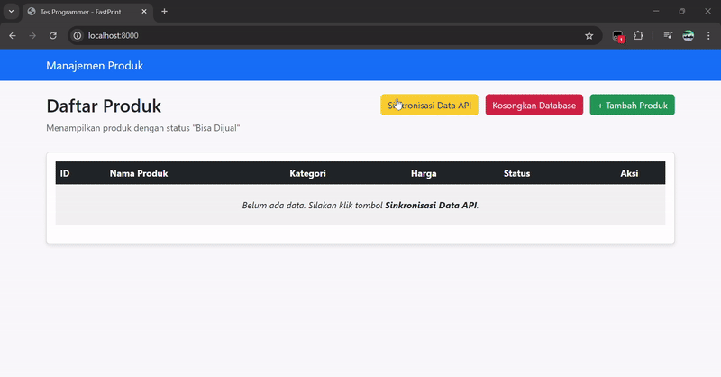
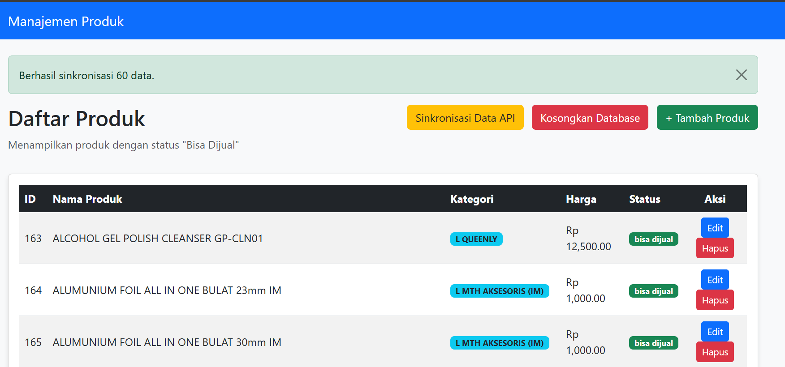
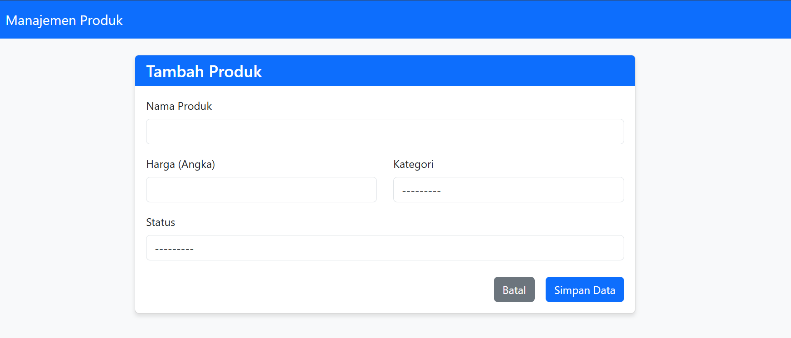

# Sistem Manajemen Produk & Sinkronisasi API

Aplikasi web berbasis Django untuk mengelola data produk. Aplikasi ini memiliki fitur utama **Sinkronisasi Otomatis** dengan API FastPrint, yang memungkinkan pengambilan data eksternal, validasi, dan penyimpanan ke database lokal (PostgreSQL) dengan mekanisme *Upsert* (Update or Insert).

## 🎥 Demo Aplikasi


Dibuat sebagai bagian dari Tes Programmer FastPrint.

---

## 📋 Fitur Utama

1.  **Sinkronisasi API (Data Ingestion)**
    * Mengambil data dari API FastPrint menggunakan method `POST` dengan autentikasi.
    * **Smart Sync (Upsert):** Mencegah duplikasi data. Jika ID produk sudah ada, data akan di-*update*. Jika belum, data akan di-*insert*.
    * Validasi data menggunakan **Django Serializer** sebelum masuk ke database.

2.  **Autentikasi API Dinamis (Real-time)** [BARU]
    * **Username Otomatis:** Sistem men-generate username sesuai format waktu server (misal: `...C21` untuk jam 9 malam).
    * **Keamanan MD5:** Password dibuat otomatis berdasarkan tanggal hari ini (`bisacoding-dd-mm-yy`) dan dienkripsi menjadi hash MD5 sebelum dikirim.

3.  **Manajemen Produk (CRUD)**
    * Menampilkan daftar produk dengan paginasi/scroll.
    * Filter otomatis: Hanya menampilkan produk dengan status "bisa dijual".
    * Tambah, Edit, dan Hapus produk secara manual.
    * **Konfirmasi Hapus:** Alert keamanan saat menghapus data agar tidak salah klik.

4.  **Reset Database (One-Click Clear)** [BARU]
    * Fitur aman untuk mengosongkan seluruh data produk, kategori, dan status.
    * Dilindungi dengan method `POST` dan konfirmasi pop-up (JavaScript) agar tidak tereksekusi tidak sengaja.

5.  **Frontend Responsif**
    * Menggunakan **Bootstrap 5** untuk tampilan yang rapi di desktop maupun mobile.
    * Format mata uang Rupiah (Rp) menggunakan library `humanize`.

---

## 🛠 Teknologi yang Digunakan

* **Backend:** Python 3.10+, Django 5.x
* **Database:** PostgreSQL
* **Frontend:** HTML5, CSS3, Bootstrap 5
* **Libraries Penting:**
    * `requests`: Untuk HTTP Request ke API eksternal.
    * `djangorestframework`: Untuk Serializer dan validasi data JSON.
    * `psycopg2-binary`: Driver koneksi PostgreSQL.
    * `python-decouple`: Manajemen Environment Variables (.env) untuk keamanan.

---

## ⚙️ Skema Database

Aplikasi menggunakan 3 tabel utama yang saling berelasi:

1.  **Kategori (`kategori`):** Menyimpan daftar kategori produk.
2.  **Status (`status`):** Menyimpan status produk (misal: bisa dijual, tidak bisa dijual).
3.  **Produk (`produk`):** Tabel utama yang menyimpan nama, harga, dan berelasi (ForeignKey) ke tabel Kategori dan Status.

---

## 🚀 Instalasi dan Menjalankan Project

Ikuti langkah-langkah berikut untuk menjalankan proyek di komputer lokal Anda:

### 1. Prasyarat
Pastikan Anda sudah menginstall:
* Python (v3.x)
* PostgreSQL
* Git

### 2. Clone Repository
```bash
git clone [https://github.com/xarksy/FastPrint.git](https://github.com/xarksy/FastPrint.git)
cd FastPrint # Sistem Manajemen Produk & Sinkronisasi API
```

### 3. Buat Virtual Environment
Disarankan menggunakan virtual environment agar library tidak tercampur.

# Untuk Windows
```Bash
python -m venv venv
venv\Scripts\activate
```

# Untuk Mac/Linux
```Bash
python3 -m venv venv
source venv/bin/activate
```

### 4. Install Dependencies
```Bash
pip install -r requirements.txt
```

### 5. Konfigurasi Environment Variable (.env)
Buat file baru bernama .env di folder root (sejajar dengan manage.py). Salin konfigurasi berikut dan sesuaikan dengan database lokal Anda:

```Bash
# Keamanan Django
SECRET_KEY=isi-secret-key-bebas-disini
DEBUG=True

# Konfigurasi Database PostgreSQL
DB_NAME=db_fastprint
DB_USER=postgres
DB_PASSWORD=password_postgres_anda
DB_HOST=localhost
DB_PORT=5432
```


### 6. Setup Database
Pastikan Anda sudah membuat database kosong bernama db_fastprint di PostgreSQL Anda. Lalu jalankan migrasi:

```Bash
python manage.py makemigrations
python manage.py migrate
```

### 7. Jalankan Server
``` Bash
python manage.py runserver
```
Buka browser dan akses: http://127.0.0.1:8000/

📸 Screenshot Aplikasi





___________________________________________________________________________________________________

🧠 Penjelasan Logika & Algoritma
1. Autentikasi Dinamis (Dynamic Auth)
    Sistem tidak menggunakan kredensial statis. Saat sinkronisasi dilakukan, sistem melakukan generate kredensial secara real-time:

        Username: tesprogrammer + ddmmyy (Tanggal) + C + HH (Jam Server).
        Password: String bisacoding-dd-mm-yy yang diubah menjadi MD5 Hash menggunakan library hashlib.

2. Logika Smart Upsert (Update/Insert) 
    Fitur sinkronisasi bekerja dengan alur cerdas untuk mencegah duplikasi:
        Django mengirim request POST ke API FastPrint.
        Data JSON diterima dan di-parsing.

    Looping Data:
        Cek apakah Kategori dan Status sudah ada? Jika belum, buat baru (get_or_create).
        Cek apakah Produk dengan ID tersebut sudah ada?
        Jika Ada: Lakukan UPDATE (data lama diperbarui).
        Jika Tidak Ada: Lakukan INSERT (buat data baru).

    Hasil: Database lokal selalu up-to-date tanpa error duplicate key.

3. Mekanisme Reset Database
    Fitur "Kosongkan Database" menggunakan perintah .delete() pada level Model Django yang aman. Ini akan menghapus seluruh data Produk beserta relasinya, namun tidak akan menghapus akun Superuser/Admin, sehingga Anda tidak perlu login ulang setelah reset.

👤 Author
Sandra

Email: randas.edso@gmail.com